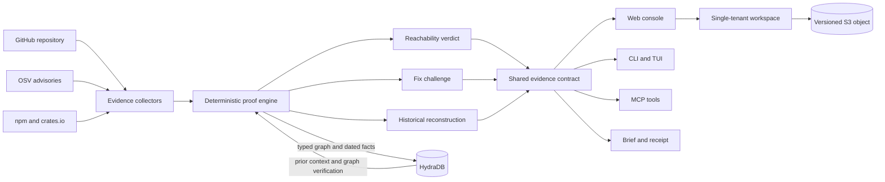
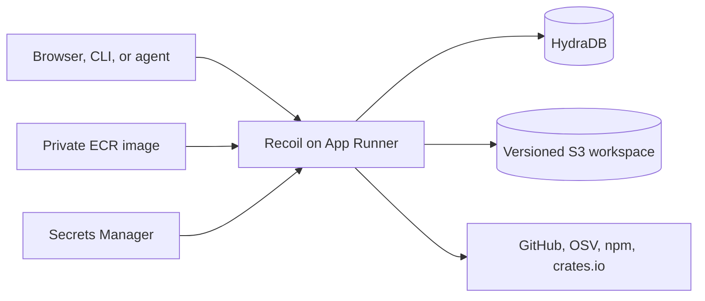

<div align="center">
  
  <h1>Recoil</h1>
  <p><strong>Prove the path. Prove the fix.</strong></p>
  <p>
    Source-backed software supply-chain investigations with temporal memory.
  </p>
  <p>
    <a href="https://nacmbw5dea.ap-south-1.awsapprunner.com">Live demo</a> ·
    <a href="#quick-start">Quick start</a> ·
    <a href="#how-it-works">How it works</a> ·
    <a href="#why-hydradb">HydraDB</a> ·
    <a href="docs/DEPLOYMENT.md">Deploy</a>
  </p>
</div>

<br />

Recoil watches public GitHub repositories, discovers affected dependency versions, and proves whether they reach sampled application source. It then dates when the path entered the repository and checks whether the advisory's real fixed version removes it.

It is not another vulnerability list. Every verdict is computed from public evidence, every route can be inspected, and missing evidence remains `UNKNOWN`.

Recoil was built for Hack Hydra. HydraDB is the durable graph and temporal-memory layer behind repository history, evidence comparison, and cross-case retrieval.

## The problem

Most dependency scanners answer one question: is an affected package present?

Recoil answers the questions an engineer needs next:

| Question | Recoil evidence |
| --- | --- |
| Does it reach our code? | Lockfile resolution plus an observed source import |
| Where does it enter? | A cited advisory to package to lockfile to source route |
| When did it appear? | The public lockfile commit that introduced the path |
| Who owns the source? | CODEOWNERS applied to the reached import site |
| What should change? | An OSV-backed fixed version and package-manager command |
| Does the fix work? | The affected-path predicate rerun against the proposed version |
| What changed since last time? | A dated comparison against prior HydraDB evidence |

## A real proof

The canonical case uses an immutable public snapshot, not generated data:

```bash
npm run cli -- --direct --fast --proof \
  "GHSA-xvch-5gv4-984h https://github.com/http-party/http-server/tree/v13.0.2"
```

Recoil finds `minimist@1.2.5` in the lockfile, follows it to the import at `bin/http-server:11`, identifies the lockfile commit that introduced the route, and verifies `1.2.6` as the advisory-backed fix.

The current HTTP Server repository resolves the fixed version and is classified `NOT_AFFECTED` against the same advisory. This is the distinction Recoil is built to make: presence, reachability, and remediation are separate claims.

## How it works



An investigation has five stages:

1. **Inventory** - Parse repository manifests, workspace members, lockfiles, source imports, commit history, and CODEOWNERS.
2. **Match** - Check exact resolved package versions against OSV in bounded request batches.
3. **Prove** - Construct only observed advisory, dependency, repository, and source relationships.
4. **Challenge** - Test the advisory-backed fixed version against the repository's declared range and residual path.
5. **Remember** - Persist typed graph relations and dated facts in HydraDB, then verify that the current case can be read back.

Recoil never installs dependencies, executes repository code, sends exploit payloads, or treats an LLM response as a verdict.

## Verdicts

| Verdict | Meaning |
| --- | --- |
| `REACHED` | An affected resolved version has an observed import in sampled source |
| `DECLARED_ONLY` | The affected dependency is resolved but no import was observed in a complete sample |
| `NOT_AFFECTED` | The resolved version is outside the advisory's affected range |
| `UNKNOWN` | Collection is incomplete or the available versions cannot be resolved safely |

The graph is an inspection surface for those conclusions. It is not a generated attack animation and it cannot create a verdict.

## Why HydraDB

HydraDB turns Recoil from a one-shot scanner into a durable exposure record.

Each completed investigation writes:

- typed advisory, package, lockfile, repository, source, symbol, and fix entities;
- observed `AFFECTS`, `RESOLVES`, `DEPENDS_ON`, `IMPORTS`, and ownership relationships;
- dated reachability and remediation facts;
- bounded provenance for every stored route;
- the case metadata needed to compare later scans.

Recoil uses HydraDB's Bring Your Own Graph ingestion path for explicit entities and relations. It then performs two separate reads:

1. a temporal recall for related prior cases;
2. a case-scoped graph read that must return a relation from the current investigation.

The local source-backed classifier remains the verdict authority. HydraDB provides durable graph memory, temporal comparison, and cross-case retrieval without being allowed to overwrite collected evidence.

## Product surfaces

| Surface | Purpose |
| --- | --- |
| **Incidents** | Open reachability findings and remediation state |
| **Repositories** | Durable watches, recurring checks, and latest status |
| **Graph** | One incident or repository evidence neighborhood at a time |
| **History** | Immutable scans, dated changes, and HydraDB recall |
| **Ask** | Bounded, cited workspace questions rather than open-ended chat |
| **Connect** | CLI, JSON, Markdown, receipts, and eight MCP tools |

Every client consumes the same investigation and receipt contracts. There is no separate UI-only verdict logic.

## Repository support

| Ecosystem | Evidence collected |
| --- | --- |
| JavaScript and npm | Root and workspace manifests, package-lock and npm-shrinkwrap v1-v3, Yarn classic and Berry, pnpm v6-v9, JS and TS imports |
| Rust and Cargo | Root and tracked workspace manifests, inherited and renamed dependencies, runtime, development, build and target-specific dependencies, Cargo.lock, Rust module and crate imports |

Repository-first scans retain the complete parsed lock inventory up to an explicit package safety ceiling. Source collection is deliberately bounded and records its sample size. Any applied ceiling is exposed as partial evidence rather than presented as a clean result.

## Quick start

Requirements: Node.js 22.12 or newer.

```bash
git clone https://github.com/lakshyashishir/recoil.git
cd recoil
npm ci
cp .env.example .env
npm start
```

Open `http://127.0.0.1:5173`. The API runs at `http://127.0.0.1:8787`.

HydraDB is optional for a local evidence replay and required for the full temporal-memory demonstration:

```dotenv
HYDRA_DB_API_KEY=...
HYDRADB_DATABASE_ID=...
HYDRADB_COLLECTION_ID=recoil
GITHUB_TOKEN=...
```

Enable the optional advisory-symbol pass only when wanted:

```dotenv
OPENAI_API_KEY=...
RECOIL_ADVISORY_AGENT=on
```

The model can propose a symbol from advisory prose. Recoil attaches it only after an exact match against the indexed source and never lets it create a graph edge or verdict.

### CLI

Repository-first inventory:

```bash
npm run cli -- "https://github.com/hydra-db/hydradb"
```

Focused advisory investigation:

```bash
npm run cli -- \
  "GHSA-xvch-5gv4-984h https://github.com/http-party/http-server/tree/v13.0.2"
```

Portable in-process mode:

```bash
npm run cli -- --direct --fast --proof \
  "GHSA-xvch-5gv4-984h https://github.com/http-party/http-server/tree/v13.0.2"
```

Receipt verification:

```bash
npm run cli -- --verify-receipt .recoil-recordings/<case-id>.json
```

### MCP and TUI

```bash
npm run mcp
npm run tui
```

The MCP server exposes the same cases, findings, graph, history, fix proof, and receipt data used by the browser and CLI. See [the MCP reference](docs/MCP.md).

## Durable workspace

The current deployment is intentionally single tenant and account-free. Its operational workspace contains repository watches, immutable case snapshots, monitor state, and notification history.

- Locally, it is stored atomically at `.recoil-data/workspace.json`.
- In production, it is mirrored to one private, encrypted, versioned S3 object.
- Startup restores S3 before accepting traffic.
- Production refuses to start if a configured S3 workspace cannot be read.
- Shutdown waits for the final queued workspace write.
- S3 writes are serialized so an older update cannot overtake a newer one.

This is a durable workspace object, not a Cloudflare Durable Object. The contract can later be partitioned by tenant ID without changing the evidence engine.

## Deploy

Recoil needs a long-running process because scans return `202 Accepted`, continue collecting evidence, and can run on a recurring watch interval. A normal static or short-lived serverless deployment is not compatible with that execution model.

The public deployment runs one App Runner instance from a private ECR image. Runtime credentials come from Secrets Manager, repository watches and case snapshots survive in a private versioned S3 object, and HydraDB remains the durable graph and temporal-memory layer.



Live deployment: [nacmbw5dea.ap-south-1.awsapprunner.com](https://nacmbw5dea.ap-south-1.awsapprunner.com)

The repository includes:

- a production multi-stage `Dockerfile`;
- an App Runner source configuration and private ECR deployment path;
- Secrets Manager access through the App Runner instance role;
- a private versioned S3 workspace stack with least-privilege IAM;
- an optional CloudFront stack for a future custom domain;
- concurrency limits, request limits, rate limiting, security headers, health checks, and graceful shutdown.

Use [the deployment runbook](docs/DEPLOYMENT.md) for the App Runner, ECR, S3, and optional CloudFront sequence.

## Validate

```bash
npm run verify
```

The gate runs the complete regression suite, the evidence benchmark, the production frontend build, and the OpenTUI compilation.

Before sharing a deployment:

```bash
npm run doctor -- --network
```

For a complete case, verify public evidence collection, a completed HydraDB write, dated temporal recall, and a current-case graph relation.

## Documentation

| Document | Contents |
| --- | --- |
| [Deployment](docs/DEPLOYMENT.md) | App Runner, S3, CloudFront, secrets, and health checks |
| [Ingestion mesh](docs/INGESTION-MESH.md) | Collector and normalization details |
| [MCP](docs/MCP.md) | Agent tools and shared contracts |
| [Product model](PRODUCT.md) | Scope, guarantees, and non-goals |

## Scope and honesty

Recoil performs bounded defensive static analysis over public records. A reached source import is not proof that a production service was exploited or that the imported symbol executes at runtime. Recoil preserves that distinction in the UI, CLI, receipts, and documentation.

Synthetic outputs are never used. Incomplete evidence is visible, source limits are recorded, and HydraDB writes that do not finish indexing remain `queued` rather than being called persisted.
